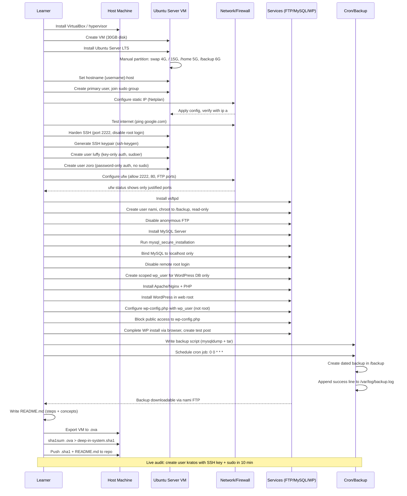

# deep-in-system — Implementation Guide

A step-by-step build guide for the deep-in-system project, ordered the way you should actually execute it (order matters — several steps depend on earlier ones being correct).

---

## Build Order — Sequence Diagram



---

## 1. Virtual Machine Setup

**Goal:** Ubuntu Server LTS, 30GB disk, manually partitioned.

- Install VirtualBox (or equivalent hypervisor).
- Create a new VM, allocate a 30GB virtual disk.
- Boot the Ubuntu Server LTS ISO and choose **manual/custom partitioning** during install (not guided — guided won't give you `/backup` as a separate partition).

**Partition layout:**

| Mount point | Size |
|---|---|
| swap | 4G |
| `/` | 15G |
| `/home` | 5G |
| `/backup` | 6G |

**Verify after install:**
```bash
lsblk -o NAME,FSTYPE,SIZE,MOUNTPOINT /dev/sda
```

**Set hostname:**
```bash
sudo hostnamectl set-hostname {username}-host
```

**Concepts to be able to explain:**
- Why swap exists and how the kernel uses it.
- Why separating `/home` and `/backup` from `/` protects the system if one fills up.

---

## 2. Primary User & sudo

- During install, create your primary user (login name = username used in hostname).
- Confirm sudo membership:
```bash
id
groups
```

**Concept:** `sudo` grants elevated privileges to a specific command for a specific user, logged and scoped — as opposed to a root shell where every command runs with full privileges regardless of necessity. This is the core "least privilege" argument you'll be asked to explain.

---

## 3. Static Network Configuration

Ubuntu Server (20.04+) uses **Netplan**. Edit the YAML file under `/etc/netplan/`:

```yaml
network:
  version: 2
  ethernets:
    enp0s3:
      dhcp4: no
      addresses:
        - 192.168.1.50/24
      routes:
        - to: default
          via: 192.168.1.1
      nameservers:
        addresses: [8.8.8.8, 1.1.1.1]
```

Apply and verify:
```bash
sudo netplan apply
ip a | grep dynamic   # must return nothing
ping -c 5 google.com
```

**Concepts to explain:**
- **Netmask/CIDR:** defines the boundary between network and host portions of an IP.
- **Why static IP matters for a server:** clients, DNS records, and firewall rules all depend on a predictable, unchanging address — a DHCP-leased IP can change and break connectivity/services.

---

## 4. SSH Hardening

Edit `/etc/ssh/sshd_config`:

```
Port 2222
PermitRootLogin no

Match User luffy
    PasswordAuthentication no
    PubkeyAuthentication yes

Match User zoro
    PasswordAuthentication yes
    PubkeyAuthentication no
```

Restart SSH:
```bash
sudo systemctl restart ssh
```

**Generate your key (on your host machine, not the VM):**
```bash
ssh-keygen -t ed25519 -f ~/.ssh/deep_in_system_key
```

**Concept:** SSH server — provides encrypted remote shell access; `Match User` blocks let you apply different auth policies to different users on one shared config.

---

## 5. Firewall (ufw)

```bash
sudo ufw allow 2222/tcp        # SSH
sudo ufw allow 80/tcp          # HTTP / WordPress
sudo ufw allow 20:21/tcp       # FTP control
sudo ufw allow 40000:50000/tcp # FTP passive range (must match vsftpd config)
sudo ufw enable
sudo ufw status verbose
```

**Be ready to justify every single open port** — this is asked directly in the audit. Nothing should be open "just in case."

---

## 6. User Management

**luffy** — key-only, sudoer:
```bash
sudo adduser luffy
sudo usermod -aG sudo luffy
sudo mkdir -p /home/luffy/.ssh
sudo cp deep_in_system_key.pub /home/luffy/.ssh/authorized_keys
sudo chmod 700 /home/luffy/.ssh
sudo chmod 600 /home/luffy/.ssh/authorized_keys
sudo chown -R luffy:luffy /home/luffy/.ssh
```

**zoro** — password-only, not sudoer:
```bash
sudo adduser zoro        # set custom password when prompted
# do NOT add to sudo group
```

Verify:
```bash
groups luffy   # luffy sudo
groups zoro    # zoro
echo ~         # as each user, confirm /home/luffy or /home/zoro
```

---

## 7. FTP Server (vsftpd)

```bash
sudo apt install vsftpd
```

Key settings in `/etc/vsftpd.conf`:
```
anonymous_enable=NO
local_enable=YES
chroot_local_user=YES
write_enable=NO
pasv_min_port=40000
pasv_max_port=50000
```

Create `nami`, restricted read-only to `/backup`:
```bash
sudo adduser nami --home /backup --no-create-home
# set custom password when prompted
sudo chown root:root /backup
sudo chmod 755 /backup
```

Restart:
```bash
sudo systemctl restart vsftpd
```

**Concept:** FTP server — transfers files over a dedicated protocol; chrooting `nami` to `/backup` and disabling write prevents them from reaching or modifying anything outside their sandbox.

---

## 8. MySQL

```bash
sudo apt install mysql-server
sudo mysql_secure_installation
```

Bind to localhost only — in `/etc/mysql/mysql.conf.d/mysqld.cnf`:
```
bind-address = 127.0.0.1
```

Disable remote root, create a scoped WordPress user:
```sql
CREATE USER 'wp_user'@'localhost' IDENTIFIED BY 'your_password';
CREATE DATABASE wordpress;
GRANT ALL PRIVILEGES ON wordpress.* TO 'wp_user'@'localhost';
FLUSH PRIVILEGES;
```

Confirm root has no `%` (any-host) entry:
```sql
SELECT host, user FROM mysql.user WHERE user='root';
```

---

## 9. WordPress

```bash
sudo apt install apache2 php php-mysql libapache2-mod-php php-curl php-gd php-xml php-mbstring
cd /tmp && wget https://wordpress.org/latest.tar.gz
tar -xzf latest.tar.gz
sudo mv wordpress/* /var/www/html/
sudo chown -R www-data:www-data /var/www/html
```

Configure `wp-config.php` with `wp_user` / `wordpress` DB (never root).

**Block public access to wp-config.php** — in the Apache vhost:
```apache
<Files wp-config.php>
    Require all denied
</Files>
```

Reload Apache, then complete setup at `http://{host}/`, log in as admin, and create a test post to prove it's functional.

---

## 10. Backup via Cron

Create `/usr/local/bin/backup.sh`:
```bash
#!/bin/bash
DATE=$(date +%F)
mysqldump -u wp_user -p'your_password' wordpress > /backup/wordpress-$DATE.sql
tar -czf /backup/wordpress-backup-$DATE.tar.gz /backup/wordpress-$DATE.sql
rm /backup/wordpress-$DATE.sql
echo "wordpress backup created!, date: $(date)" >> /var/log/backup.log
```

```bash
sudo chmod +x /usr/local/bin/backup.sh
sudo crontab -e
```
Add:
```
0 0 * * * /usr/local/bin/backup.sh
```

**Test it live** (auditors will do this): temporarily change schedule to `* * * * *`, remove old backups/log, wait a minute, then check via `nami` FTP login and `cat /var/log/backup.log`.

**Concepts to explain:**
- **Cron job:** a scheduled, recurring task run by the system cron daemon based on a time pattern.
- **Why backups matter:** protection against human error, hardware failure, ransomware/virus, power loss, and disasters — and they save time/money in recovery.

---

## 11. Live Exam Prep — kratos user (10-minute drill)

Practice this cold, timed:
```bash
# 1. Create the user
sudo adduser kratos

# 2. Add to sudo
sudo usermod -aG sudo kratos

# 3. Generate SSH key (on your machine)
ssh-keygen -t ed25519 -f ~/.ssh/kratos_key

# 4. Install the public key
sudo mkdir -p /home/kratos/.ssh
sudo nano /home/kratos/.ssh/authorized_keys   # paste kratos_key.pub content
sudo chmod 700 /home/kratos/.ssh
sudo chmod 600 /home/kratos/.ssh/authorized_keys
sudo chown -R kratos:kratos /home/kratos/.ssh

# 5. Test
ssh kratos@{vm-ip} -p 2222 -i ~/.ssh/kratos_key
sudo whoami   # should return root without error
```

If this fails during the live audit, **the project is failed** — so this step deserves the most repetition.

---

## 12. Documentation & Submission

- Write `README.md` covering every step above in your own words, plus explanations of each concept (sudo, netmask, SSH, firewall, FTP, cron, backups).
- Export the VM:
```bash
sha1sum deep-in-system.ova > deep-in-system.sha1
```
- Repository must contain exactly:
  - `deep-in-system.sha1`
  - `README.md`

---

## Quick Concept Cheat-Sheet (for oral audit questions)

| Question | One-line answer to internalize |
|---|---|
| What is sudo/sudo group? | Grants elevated privilege per-command, per-user, logged — not a full root shell. |
| What is a netmask? | Splits an IP into network and host portions, defining the local subnet's size. |
| Why static IP for a server? | Predictable address for DNS, firewall rules, and client connections. |
| What is an SSH server? | Provides encrypted remote shell access to the machine. |
| What is a firewall? | Filters traffic by port/protocol; only explicitly justified ports should be open. |
| What is an FTP server? | Dedicated protocol for file transfer; chroot + permissions sandbox each user. |
| What is a cron job? | A time-scheduled recurring task executed by the system's cron daemon. |
| Why backups? | Recovery from human error, hardware failure, attacks, power loss, disasters. |