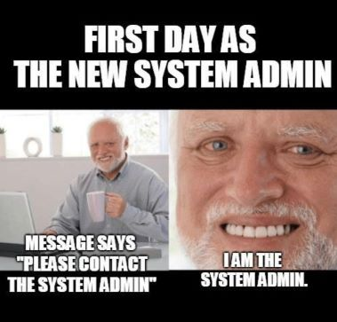

## deep-in-system



### Overview

This project provides hands-on experience in Linux system administration
by guiding you through the setup and configuration of an Ubuntu Server
environment. You will configure networking, security, users, services, and
backups, gaining practical skills required to manage and secure a production-like Linux server.

### Learning Objectives

By completing this project, you will be able to:

- Install and configure an Ubuntu Server with custom disk partitioning.
- Manage users, permissions, and authentication mechanisms securely.
- Configure networking, firewalls, and SSH access following security best practices.
- Deploy and secure common Linux services such as FTP, MySQL, and WordPress.
- Implement automated backup strategies using cron jobs and system tools.

### Instructions

#### Command Line Prerequisites

**Essential Commands:**

- `sudo`, `systemctl`, `apt install`, `nano`, `ssh-keygen` - System administration basics
- [Ubuntu Command Line Tutorial](https://ubuntu.com/tutorials/command-line-for-beginners) - Ubuntu Official

#### The Virtual Machine

Install the latest Ubuntu Server LTS as a virtual machine.

- The VM disk size must be 30GB.

- You must divide your VM disk into these partitions:

  `swap`: 4G
  `/`: 15G
  `/home`: 5G
  `/backup`: 6G

- Your username must be your login name.

- You have to set your hostname with the format of `{username}-host`, if your login is `potato`, then your hostname must be `potato-host`.

#### The Network

Set a static private IP address, you are free to choose which netmask to use.

You must be able to connect to the Internet. You can test connectivity with:

```console
$> ping -c 5 google.com
```

> You must not have any network interface configured with dynamic IP assignment (DHCP).

#### The Security

> You do not have to use the root user in your setup process!
> You won't need it when you have `sudo`.
> Sudo provides fine-grained access control. It grants elevated permissions to only a particular program that requires it. You know which program is running with elevated privileges, rather than working with a root shell (running every command with root privileges).

- You have to disable remote root login via ssh.

- Change the SSH port to: `2222`.

- Configure the Firewall, and close all incoming ports, only used ports must be opened.
  > All open ports must be justified in the audit!

#### User Management

You have to create 2 users in your server as follows:

##### 1- _luffy_:

- SSH authentication method: Public key-based authentication
- Home directory: `/home/luffy`
- Sudoer: yes
- ssh-key: your generated SSH key

> You have to keep your SSH key ready for the audit session!

##### 2- _zoro_:

- SSH authentication method: Password authentication
- Home directory: `/home/zoro`
- password: Use your custom password
- sudoer: no

> You will use your custom password for the audit session!
> During the audit, you will be asked to create a new user with SSH key-based authentication and sudo access within a limited time. Make sure you master the process!

#### Services

- Install an FTP server and create a user `nami`.
  - The user `nami` must have FTP access restricted to the /backup directory with read-only permissions.
  - `nami` user password: Use your custom password

> You will use your custom password for the audit session!
> Do not enable anonymous access. This is a security risk.

#### The Database

- You have to install MySQL Server

- Disable the remote connection to the root user.

- Do not allow MySQL connections from outside the server. To improve the security of your website, you should keep your MySQL server accessible only by applications in the server. his restriction should not negatively affect your solution.

- You must create a MySQL user, which has the only required access to the WordPress database.
  > Don't use the root user in your WordPress website!

#### WordPress

- You have to install WordPress

- WordPress must be in your web server root directory: `http://{host}/`

- WordPress must function correctly. Try to post something or create another user, any way you are free to do anything.

> The configuration file must not be publicly accessible. Try `http://{host}/wp-config.php`

#### Backup

Backups protect against human errors, hardware failure, virus attacks, power failures, and natural disasters. Backups can help save time and money if these failures occur.

In this exercise, you will set up a simple backup method by using cron jobs.

- Set up a cron job that runs every day at 00:00, it must create a tar file of the WordPress database.

- The backup files must be created in the `/backup` folder.

- The backup file name must contain the creation date.

- You must append a line to a log file (`/var/log/backup.log`) indicating that the backup was successful and including the execution time.

- Your backup files must be downloadable from the `nami` FTP user.

### Bonus

If you complete the mandatory perfectly, you can move to this part.
You can add anything you feel deserves to be a bonus, some of the suggested ideas:

- Install a Minecraft server. It must automatically start and remain running after a system reboot.

- Automate all instructions with ansible, so you can reproduce this setup across multiple servers efficiently.

- Set up the SSL in the web server and FTP server, you can use self-signed SSL.

_Challenge yourself!_

### Documentation

Create a `README.md` documenting all the knowledge you gained and the steps you followed to set up the server. It should include clear and thorough explanations of each step, as well as explanations of the commands used. Ensure the document is well structured, concise, and contains all relevant information about the installed and configured services. This file must be submitted as part of the project solution.

### Tips

Read the entire project before starting implementation!

Try to understand all the commands that you will use in your setup.

Save every command you run; it will be useful if you need to reinstall the server or debug issues.

Create a backup of every configuration file you modify. This will help you recover if a configuration breaks.

> In this project, some passwords and private keys are intentionally exposed for learning purposes. This is never recommended in real-world environments.
> Don't use these passwords and private keys outside this learning project!

### Resources

1. **Ubuntu Server Setup**
   [Ubuntu Server Installation Guide](https://ubuntu.com/tutorials/install-ubuntu-server) - Ubuntu Official
   _VM installation, partitioning, basic configuration_

2. **System Administration Basics**
   [Ubuntu Server Guide](https://ubuntu.com/server/docs) - Ubuntu Official
   _User management, SSH, firewall, services_

3. **MySQL Database Setup**
   [MySQL Installation on Ubuntu](https://documentation.ubuntu.com/server/how-to/databases/install-mysql/) - MySQL Official
   _Database installation and security configuration_

4. **WordPress Installation**
   [WordPress Ubuntu Installation](https://wordpress.org/support/article/how-to-install-wordpress/) - WordPress Official
   _Web server setup and WordPress configuration_

### Submission and audit

You must export your VM to a safe place, you will need it in the audit.
You will use your exported VM to run a new VM for each audit.
Push the shasum of your exported VM, you can get it this way:

```console
user:~$ sha1sum deep-in-system.ova > deep-in-system.sha1
user:~$ cat deep-in-system.sha1 | cat -e
<...>255bfef9560<...>  deep-in-system.ova$
user:~$
```

Files that must be inside your repository:

- deep-in-system.sha1
- README.md

> During the audit, learners will be asked to explain configuration choices and core system administration concepts.
> It's forbidden to use external scripts!
> Any use of external scripts or use of commands without understanding their jobs is considered cheating!
